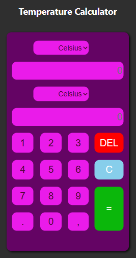
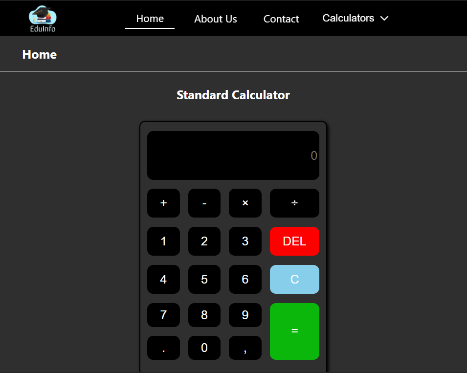

# </img> useCalc 
## [Visit Site](https://usecalc.000webhostapp.com/)

## Technologies used
</img>
</img>
</img>
</img>

### Setup Repository

1. Fork this Repository
2. Clone Repository in your PC using `git clone "Repo URL"`
3. Run `npm install` or `yarn install` command in your teriminal.
4. Run `npm run start` or `yarn start` command to see application in browser.

### Features

1. App contains **4 different types of Calculators** which is used to **Calculate day-to-day Calculations**.
 
</img>
</img>
</img>
</img>

2. WebApp is also responsive for all devices.
 
*Mobile Devices :*
 
</img>
 
*Tablet :*
 
</img>
 
*Desktop :*
 
</img>